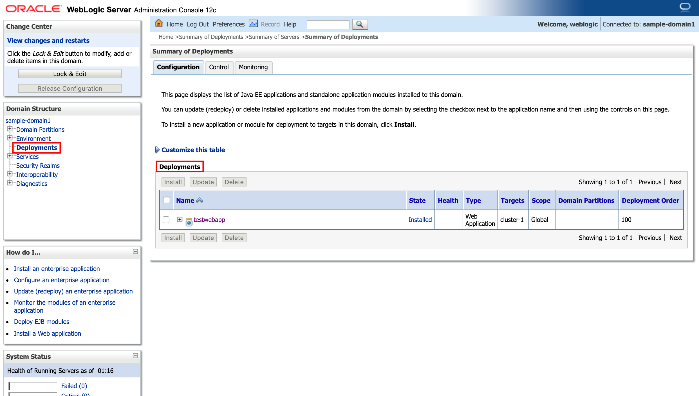

## HOL5318/1 ##

### Build Bank Web Application and deploy on WebLogic running on Kubernetes ###

#### Prepare the environment variables to use the shared WebLogic Domain ####

The Java EE application is ready to build using Maven. The Maven build also contains deploy step using `curl` against WebLogic REST Management interface. All the necessary values set by environment variables. Open a terminal and use the following commands to set the variables using instructor provided values. It should be similar like the following snippet:
```bash
export PARTICIPANT_ID=101
export WLS_SERVER=150.136.197.41:80
export WLS_ADMIN_USER=weblogic
export WLS_ADMIN_PASSWORD=password
export WLS_TARGET=cluster-1
export OCIR_PASSWORD='p6(}e<.YRu+x<5F3Kriv'
```
Using the values above check the WebLogic Domain using the Administration console. Open a browser and enter the public IP address of the WebLogic server, like: `http://150.136.197.41/console`. Enter the user name and password and click __Login__


Select _Deployments_ in the left tree menu to verify what applications are deployed. You may see deployed applications, but you should not see such application which name contains your PARTICIPANT_ID (your unique number).



#### Build and deploy Bank Web Application ####

No use the terminal where the environment variables were set and change to the web application source directory.
```bash
cd /u01/content/wls-helidon
```
Build the Bank Web Application using Maven:
```bash
mvn clean package
```
At the end of the build you have to see similar output which contains the SUCCESS information twice. First for the deployment (`"message": "Deployed the application 'bestbank101'.", "severity": "SUCCESS"`) and second for the complete Maven build (`[INFO] BUILD SUCCESS`):
```bash
[INFO] Scanning for projects...
[INFO]
[INFO] ------------------------------------------------------------------------
[INFO] Building BestbankWebapp 1.0.0
[INFO] ------------------------------------------------------------------------
Downloading: https://repo.maven.apache.org/maven2/org/apache/maven/plugins/maven-resources-plugin/2.6/maven-resources-plugin-2.6.pom
Downloaded: https://repo.maven.apache.org/maven2/org/apache/maven/plugins/maven-resources-plugin/2.6/maven-resources-plugin-2.6.pom (8.1 kB at 6.8 kB/s)
...
...
...
},
"messages": [{
    "message": "Deployed the application 'bestbank101'.",
    "severity": "SUCCESS"
}],
"links": [{
    "rel": "job",
    "uri": "http:\/\/150.136.197.41:80\/management\/wls\/latest\/jobs\/deployment\/id\/8"
}]
}[INFO] ------------------------------------------------------------------------
[INFO] BUILD SUCCESS
[INFO] ------------------------------------------------------------------------
[INFO] Total time: 59.907 s
[INFO] Finished at: 2019-09-04T11:17:06-04:00
[INFO] Final Memory: 36M/495M
[INFO] ------------------------------------------------------------------------
```
You can check the application first on the administration console.


Open the application using the WebLogic Server's IP address and the following context path format: `/bestbank<PARTICIPANT_ID>`. For example: `http://150.136.197.41/bestbank101/`.


Now your initial version of BestBank Web Application is deployed. You can move forward to the [next step](2.build.creditscore.helidon.microservice.md).
