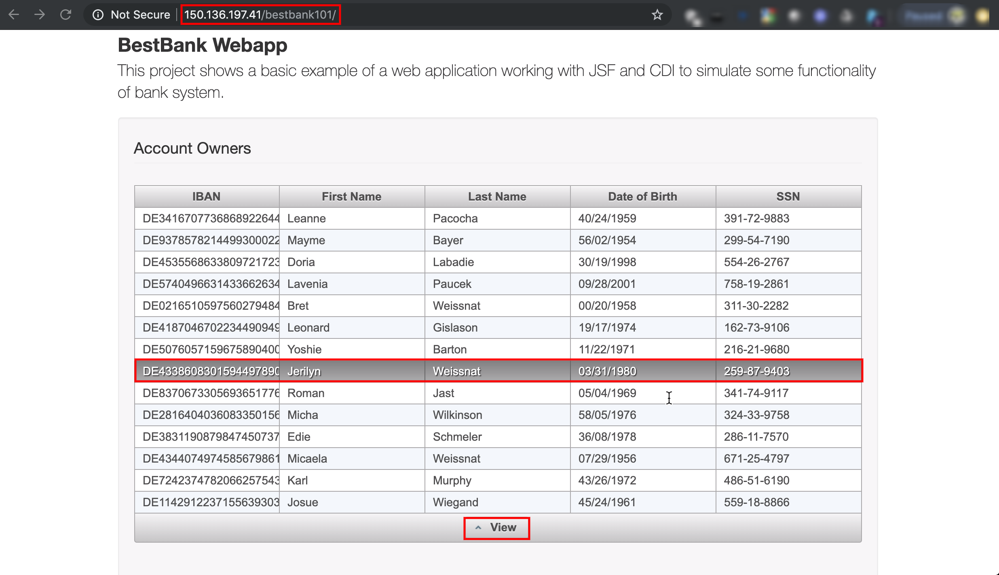
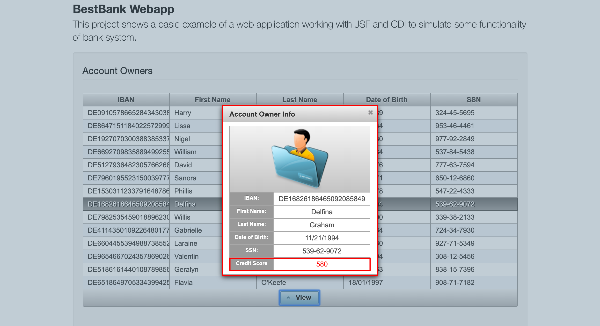

## HOL5318/3 ##

### Modify Bank Web Application to use Credit Score Microservices Application ###

Before the re-deployment of the Bank Web Application the following changes will be made:
1. Modify the User Interface. Create __View__ button which opens Account Owner details window. This detail window will show the credit score value of the Account Owner.
2. Modify the server side bean to invoke Credit Score Microservices Application.
3. Configure the endpoint for the Bank Web Application

#### Modify Bank Web Application ####

Open for edit the `/u01/content/wls-helidon/src/main/webapp/index.xhtml` HTML file.
```bash
gedit /u01/content/wls-helidon/src/main/webapp/index.xhtml &
```
Find and delete all the lines which contain __REMOVE THIS LINE__ comment. Only that one(!), but that full line of comment which contains. (4 lines needs to be removed.) Save the file.
If you familiar with JSF to check what has changed in the code.

Open for edit `/u01/content/wls-helidon/src/main/java/com/oracle/oow19/wls/bestbank/AccountOwnerBean.java` class file.
```bash
gedit /u01/content/wls-helidon/src/main/java/com/oracle/oow19/wls/bestbank/AccountOwnerBean.java &
```
Find and delete all the lines which contain __REMOVE THIS LINE__ comment. Only that one(!), but that full line of comment which contains. (6 lines needs to be removed.) Save the file.
Check what has changed in the code. The `postConstruct` method modified to read the enpoint URL from the property file. New `getCreditScore` method created to calculate the credit score value of the Account Owner. Finally include the new method invocation in `getSelectedAccountOwner` method which is triggered by the __View__ button on the User Interface.

The last file to modify is the `/u01/content/wls-helidon/src/main/resources/app.properties` file. The Bank Web Application reads this properties file to know the endpoint's URL. Obviously this solution is just for demo purposes, because in real microservices architecture the best practice is to use additional tools for better service/API management.
```bash
gedit /u01/content/wls-helidon/src/main/resources/app.properties &
```
Replace the __PARTICIPANT_ID__ to your unique id and save. For example:
```
creditscore.url=http://helidon-creditscoreservice.helidon101.svc.cluster.local:8080/creditscore
```
Please note this is the internal URL of the service ensured by the Kubernetes DNS-Based Service Discovery. The first part is the _service_ name which is followed by the _namespace_. The `svc.cluster.local` is based on the internal DNS. The last part of the URL is the mapped port number and finally the context path of the REST endpoint.

#### Build and deploy the modified Bank Web Application ####

Make sure you are in the terminal where the environment variables are set. Change to the Bank Web Application's directory:
```bash
cd /u01/content/wls-helidon
```
Run the following Maven command:
```bash
mvn clean package
```
When the build is done refresh the browser page where the web application is opened. If you closed use the IP address of the WebLogic Server (WLS_SERVER) and the context path _/bestbankPARTICIPANT_ID_ to construct the URL of your web application. Select an Account Owner and click the new __View__ button.



You have to see the details of the Account Owner in a new window including the new credit score value calculated by the microservices application.



You can check the Credit Score microservices application log entries which show the response data, including the calculated credit score value.
First identify the pod name:
```bash
$ kubectl get pod -n helidon$PARTICIPANT_ID
NAME                                   READY     STATUS    RESTARTS   AGE
helidon-creditscore-5658c5686d-vdtrw   1/1       Running   0          155m
```
Copy the name of the pod from the result into the following command to get the log:
```bash
$ kubectl logs -n helidon$PARTICIPANT_ID helidon-creditscore-5658c5686d-vdtrw
```
Check the log entries produced by `io.helidon.bestbank.creditscore.CreditscoreService` logger:
```bash
[DEBUG] (main) Using Console logging
2019.09.05 22:07:34 INFO io.helidon.webserver.NettyWebServer Thread[main,5,main]: Version: 1.2.0
2019.09.05 22:07:34 INFO io.helidon.webserver.NettyWebServer Thread[nioEventLoopGroup-2-1,10,main]: Channel '@default' started: [id: 0x5e86efed, L:/0.0.0.0:8080]
WEB server is up! http://localhost:8080/greet
2019.09.06 00:32:19 INFO io.helidon.bestbank.creditscore.CreditscoreService Thread[nioEventLoopGroup-3-1,10,main]: Request: {"dateofbirth":"11/21/1994","firstname":"Delfina","id":"DE16826186465092085849","lastname":"Graham","score":"580","ssn":"539-62-9072"}
```

Congratulate you completed the _Integrating Helidon and Oracle WebLogic on Kubernetes/Oracle Cloud Infrastructure_ (HOL5318) hands on lab.
